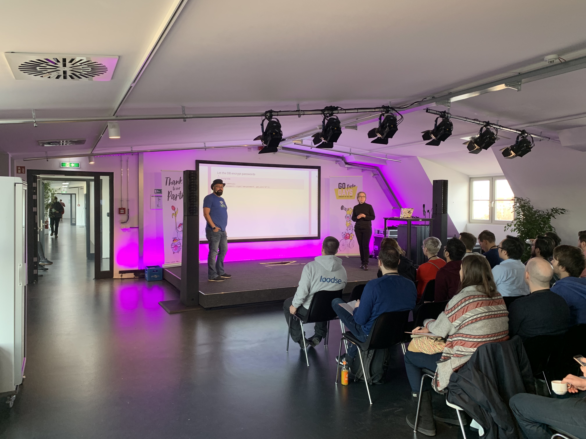
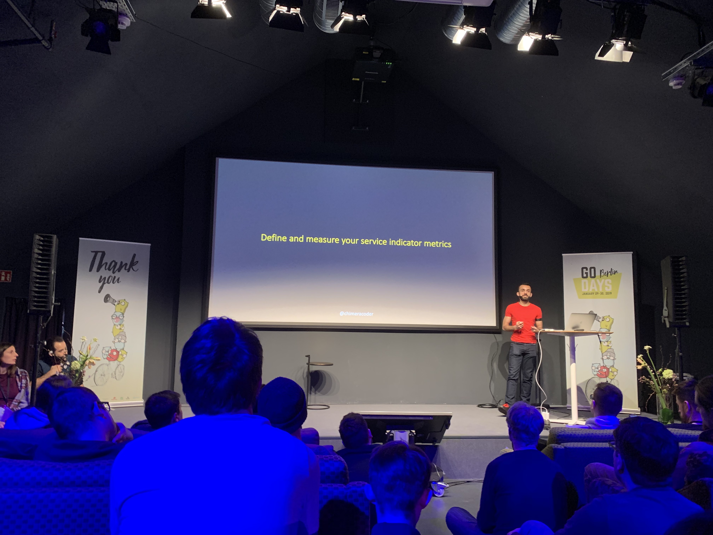

It's Wednesday, a cold winter morning and I am on my way to _Factory Görlitzer Park_, the venue of the very first Golang conference in Berlin. It is located in charismatic surroundings of the Kreuzberg district. I arrived yesterday after a 4-hour bus ride from Prague to my Berlin hotel, excited to attend a Golang conference for the first time. Through the cold streets of rising Kreuzberg, I crossed the river to the entrance of the Factory. 

A warm welcome was waiting for me. The conference venue was located in the last, 5th floor of this architectonic masterpiece. The event was perfectly organized with flawless registration.The food catering worked well even with my specific diet. I also appreciated that the conference talks were on time and without technical issues or hiccups. But since the talks themselves were the highlight, I would like to share three that inspired me the most.

The first talk of the conference was about the importance of beginners in Go. [Natalie Pistunovich](https://twitter.com/NataliePis), Berlin well-known meetups organizer, pointed out that the number of gophers (members of the golang community) doubled over the past year. It is very easy to trust that number: Golang is everywhere. Almost every company out there relies on an open source project written in Go (Docker, Kubernetes, Grafana and many more), job offer listings are full of golang opportunities and a lot of companies choose Golang when a rewrite of their codebase is required. All those beginners need our help to surpass a steep learning curve. They'll bring fresh wind into the community and new ideas as in a return. I am in. 

The show continued with an energizing talk _Going Secure with Go_ from [Baruch Sadogursky](https://twitter.com/jbaruch) and [Elena Grahovac](https://twitter.com/webdeva). Baruch's 20 minute monologue about dependency problems was most enjoyable, the presenters were really into the topic and were able to captivate the crowd. Some highlights from the talk:
- don't store secrets (database URIs, username, passwords, tokens) in the git
- don’t store them even in a container's environment values (for kubernetes configuration)
- the best approach is to use built-in kubernetes secrets or a tool like Hashicorp's Vault, otherwise, they could be unintentionally exposed
- be careful about your dependencies
- use a dependency if it’s development is active, it has more than one maintainer, suitable code coverage and an acceptable license
- lock your dependencies, (even the patch version) and update regularly with caution

The third talk that inspired me most was the very last of the conference. It was about diversity in the Go community. [Ronna Steinberg](https://twitter.com/ronnax) revealed unpleasant numbers: a white man is more likely to find a job, to be promoted and to have a higher probability of being in leading role position. It's 2019, this should've been solved already. Ronna is the leader of Women Who Go, the women go community, and knows a lot about the topic. She presented a slide with the results of a survey, where the researchers asked women programmers which languages they knew. There was a lot of Java, Javascript, C++, and Python, but no Go. That is a deficit that we, the go community, need to tackle.

While I enjoyed many aspects, the conference also had its shortcomings. I would like for there to have been better coffee (yes, I am a coffee nerd). The English quality of some speakers wasn't the best (I will never get used to the Dutch accent), and I would have appreciated more comfortable chairs in the main stage room. 

It's time to head back to my hotel. The Kreuzberg evening feels different - it's dark and cold but pulsing with a cozy atmosphere of local bars. The conference amazed me. Berlin, I'll be back next year - it was a blast!

_Thanks to Sara Parrott for grammar corrections._